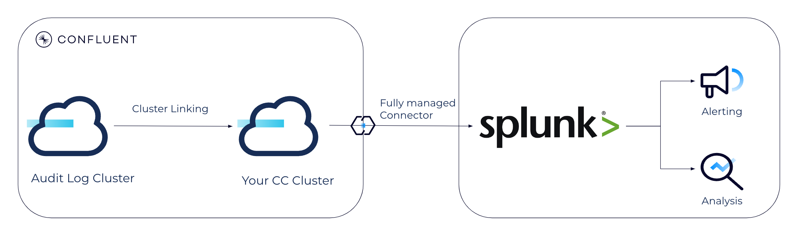

# Confluent Cloud Audit Logs management with Splunk

This repository sets up a fully managed pipeline to define alerts in Splunk based on the CC Audit Logs

## Requirements
* Dedicated CC cluster (required for Cluster Linking)
* Splunk instance

## How to

A detailed step-by-step explanation is provided in the corresponding [blog article](https://www.confluent.io/en-gb/blog/alerting-pipeline-confluent-cloud-audit-logs/).

[Example video](https://github.com/pneff93/cc-audit-logs-splunk/assets/39708443/e3899e44-a989-45bc-b550-153ea1b54df0)

### Commonly Used Alerts

| Alert                                        | Audit log                                                                                                                                                                                                 | Splunk search                                                                                                                          | Verified |
|----------------------------------------------|-----------------------------------------------------------------------------------------------------------------------------------------------------------------------------------------------------------|----------------------------------------------------------------------------------------------------------------------------------------|----------|
| CC cluster deletion                          | [DeleteKafkaCluster](https://docs.confluent.io/cloud/current/monitoring/audit-logging/event-methods/organization-events.html#deletekafkacluster)                                                          | `source="http:Confluent Audit Logs" data.methodName="DeleteKafkaCluster" data.cloudResources{}.resource.resourceId="<lkc-prod>"`                                                             | ✅        |
| Environment deletion                         | [DeleteEnvironment](https://docs.confluent.io/cloud/current/monitoring/audit-logging/event-methods/organization-events.html#deleteenvironment)                                                            | `source="http:Confluent Audit Logs" data.methodName="DeleteEnvironment"`                                                               | ✅        |
| Authentication failure to CC cluster         | [kafka.Authentication](https://docs.confluent.io/cloud/current/monitoring/audit-logging/event-methods/authorization-authentication-events.html#kafka-authentication)                                      | `source="http:Confluent Audit Logs" data.methodName="kafka.Authentication" data.result.status="UNAUTHENTICATED"`                       | ✅        |
| Authentication failure to Schema Registry    | [schema-registry.Authentication](https://docs.confluent.io/cloud/current/monitoring/audit-logging/event-methods/sr-authn-authz.html#schema-registry-authentication)                                       | `source="http:Confluent Audit Logs" data.methodName="schema-registry.Authentication" data.authenticationInfo.result="UNAUTHENTICATED"` |          |
| Authorization failure to CC cluster resource | [io.confluent.kafka.server/authorization](https://docs.confluent.io/cloud/current/monitoring/audit-logging/event-methods/authorization-authentication-events.html#ak-cluster-authorization-event-methods) | `source="http:Confluent Audit Logs" type="io.confluent.kafka.server/authorization" data.authorizationInfo.granted="false"`             |✅ |
| Authorization failure based on IP filter     | [ip-filter.Authorize](https://docs.confluent.io/cloud/current/monitoring/audit-logging/event-methods/ip-filter-authz.html#ip-filter-authorize)                                                            | `source="http:Confluent Audit Logs" data.methodName="ip-filter.Authorize" data.authorizationInfo.result="DENY"`                        | |
| OrgAdmin role binding provided               | [BindRoleForPrincipal](https://docs.confluent.io/cloud/current/monitoring/audit-logging/event-methods/rbac.html#bindroleforprincipal)                                                                     | `source="http:Confluent Audit Logs" data.methodName="BindRoleForPrincipal" data.request.data.role_name="OrganizationAdmin"`            | ✅        |
| Health Check failure                         | There is no specific health check event, however it might make sense to define an alert when we do not receive any Audit Log event over some time which could indicate a broken pipeline.                 | `source="http:Confluent Audit Logs"`                                                                                                   |    ✅      |

## Additional notes

### Contribution

Different customers have different requirements as well as new features are released on Confluent Cloud frequently. 
If you think, that there are alerts missing, I encourage you to collaborate directly to this repository or reach out to me
on [LinkedIn](https://www.linkedin.com/in/patrick-neff-7bb3b21a4/).
