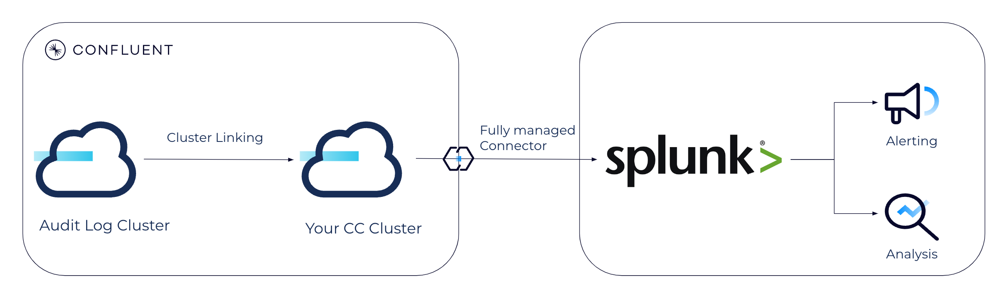
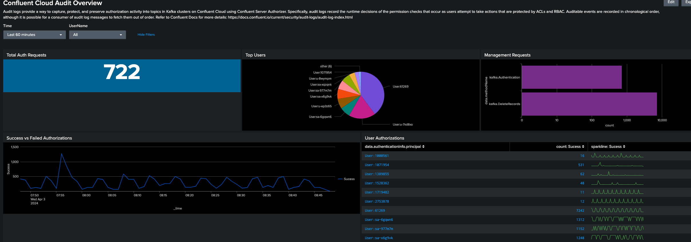
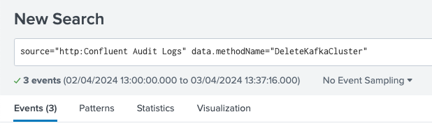
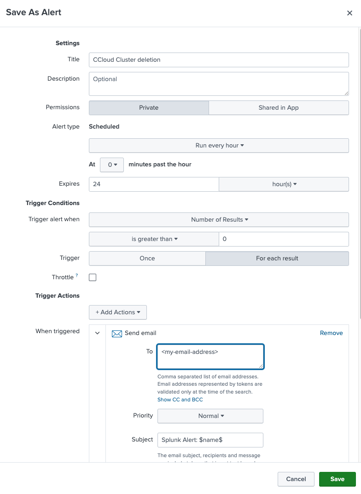
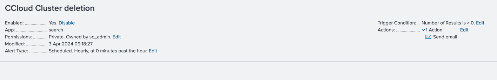
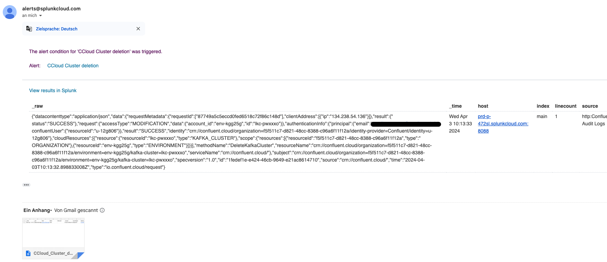

# Confluent Cloud Audit Logs management with Splunk

This repository sets up a fully-managed pipeline to define alerts in Splunk based on the CC Audit Logs



## Requirements
* Dedicated CC cluster (required for Cluster Linking)
* Splunk instance

## Transfer Audit Logs into your CC cluster using Cluster Linking

Audit Logs are stored on an external cluster, on which we cannot configure a fully-managed Connector.
Therefore, we need to use Cluster Linking to transfer the events into your CC cluster.

[Use Cluster Linking to Manage Audit Logs on Confluent Cloud](https://docs.confluent.io/cloud/current/multi-cloud/cluster-linking/audit-logs.html#cloud-cluster-link-audit-logs)
provides a great step-by-step guideline.

## Splunk Cloud Platform

You can get a 14 days free trial of [Splunk Cloud Platform](https://www.splunk.com/en_us/products/splunk-cloud-platform.html)


> [!NOTE]
> Due to my lack of knowledge regarding Splunk, there might be definitely space for improvements regarding
> security, performance, and indexing. This repository aims for simplicity and should be seen as a baseline.
> 
> Also, the [Terraform Provider for Splunk Cloud Platform](https://github.com/splunk/terraform-provider-scp) does not
> support dashboards and alerts as of today, therefore we create all resources through the UI


Once registered, you receive an email with the following information
* Splunk URL
* User name
* Password

In Splunk, under `Settings --> Data inputs`, we create a new HTTP Event Collector with the name `Confluent Audit Logs` and default configurations.

---

## Deploy fully-managed Splunk Connector

In CC, we deploy a [fully-managed Splunk Sink Connector](https://docs.confluent.io/cloud/current/connectors/cc-splunk-sink.html).
For the Authentication configuration, we get the `HEC URI` from the registration email, and the `HEC Token`from the HTTP Event Collector.
For simplicity, we also set the `HEC SSL Validate Certificates` to false.

The full configurations:

````json
{
  "topics": "confluent-audit-log-events",
  "schema.context.name": "default",
  "input.data.format": "JSON",
  "connector.class": "SplunkSink",
  "name": "pneffAuditLogsDemo",
  "kafka.auth.mode": "KAFKA_API_KEY",
  "kafka.api.key": "XX23MPJ6QHL3U43B",
  "kafka.api.secret": "****************************************************************",
  "splunk.hec.uri": "https://prd-p-472sl.splunkcloud.com:8088",
  "splunk.hec.token": "************************************",
  "splunk.hec.ssl.validate.certs": "false",
  "splunk.indexes": "default",
  "splunk.hec.raw": "false",
  "splunk.hec.track.data": "false",
  "splunk.hec.http.keepalive": "true",
  "splunk.hec.max.http.connection.per.channel": "2",
  "splunk.hec.total.channels": "2",
  "splunk.hec.socket.timeout": "10",
  "splunk.hec.use.record.timestamp": "true",
  "splunk.hec.threads": "1",
  "splunk.hec.max.outstanding.events": "10000",
  "splunk.hec.max.retries": "-1",
  "splunk.hec.backoff.threshhold.seconds": "60",
  "splunk.hec.json.event.formatted": "false",
  "splunk.hec.max.batch.size": "500",
  "splunk.hec.lb.poll.interval": "120",
  "splunk.flush.window": "30",
  "splunk.hec.ack.enabled": "false",
  "splunk.header.support": "false",
  "max.poll.interval.ms": "300000",
  "max.poll.records": "500",
  "tasks.max": "1"
}
````

To get a first impression of the data, check under `Search & Reporting` and search for `source="http:Confluent Audit Logs"`


## Splunk dashboards

Thanks to JohnnyMirza's [ccloudauditlogs_splunk](https://github.com/JohnnyMirza/ccloudauditlogs_splunk), we can copy some basic dashboards
and import them into our Splunk.



For additional dashboards check out his repository and also his blog article [How to Visualise Confluent Cloud Audit Log Data](https://www.confluent.io/blog/visualize-logs-for-simplified-security-in-confluent-cloud/).

## Splunk alerts

A general tutorial about alerts is provided by Splunk [Creating Alerts in Splunk Enterprise](https://www.youtube.com/watch?v=8jvEmAmQNug).

> [!NOTE]
> Because we are using a free trial we are limited in defining alerts. For example, we cannot create real-time alerts but just scheduled
> ones. 
> 
> Also, we send the alerts via email but you might consider configuring a webhook to send the alerts into your preferred system, such as Slack or Teams.

Further down is a table of possible useful alerts, the table is created based on discussions with customers and colleagues.
We will provide one step-by-step workflow of how setting up everything, for the remaining ones you can refer to the table.

### Define CC cluster deletion alerts

We want to create an alert once a CC cluster has been deleted. This does not need to be a critical issue but could be (think of a production cluster).

We get the corresponding event name from the [Confluent documentation](https://docs.confluent.io/cloud/current/monitoring/audit-logging/event-methods/organization-events.html#deletekafkacluster)
and search for it under `Search`



Under `Save As` we can define the alert.



Finally, we see the alert under `Alerts`


Now we delete a CC cluster in our organization and receive (after some time due to the scheduled job) an alerting email.
Within that email we also have the raw Audit Log event, so that we can further analyse who deleted which cluster.



> 🎉
> We successfully created a pipeline that proactively notifies us once certain events are happening in our CC org! 

### Possible alerts

| Alert                                       | Audit Log                                                                                                                                                                                                 | Splunk search                                                                                                                          | Verified |
|---------------------------------------------|-----------------------------------------------------------------------------------------------------------------------------------------------------------------------------------------------------------|----------------------------------------------------------------------------------------------------------------------------------------|----------|
| Resource deletion - CC cluster              | [DeleteKafkaCluster](https://docs.confluent.io/cloud/current/monitoring/audit-logging/event-methods/organization-events.html#deletekafkacluster)                                                          | `source="http:Confluent Audit Logs" data.methodName="DeleteKafkaCluster"`                                                              | ✅        |
| Resource deletion - Environment             | [DeleteEnvironment](https://docs.confluent.io/cloud/current/monitoring/audit-logging/event-methods/organization-events.html#deleteenvironment)                                                            | `source="http:Confluent Audit Logs" data.methodName="DeleteEnvironment"`                                                               | ✅        |
| Authentication failure - to CC cluster      | [kafka.Authentication](https://docs.confluent.io/cloud/current/monitoring/audit-logging/event-methods/authorization-authentication-events.html#kafka-authentication)                                      | `source="http:Confluent Audit Logs" data.methodName="kafka.Authentication" data.result.status="UNAUTHENTICATED"`                       | ✅        |
| Authentication failure - to Schema Registry | [schema-registry.Authentication](https://docs.confluent.io/cloud/current/monitoring/audit-logging/event-methods/sr-authn-authz.html#schema-registry-authentication)                                       | `source="http:Confluent Audit Logs" data.methodName="schema-registry.Authentication" data.authenticationInfo.result="UNAUTHENTICATED"` |          |
| Authorization failure - to CC cluster | [io.confluent.kafka.server/authorization](https://docs.confluent.io/cloud/current/monitoring/audit-logging/event-methods/authorization-authentication-events.html#ak-cluster-authorization-event-methods) | `source="http:Confluent Audit Logs" type="io.confluent.kafka.server/authorization" data.authorizationInfo.granted="false"`                   |✅ |
| Authorization failure based on IP filter | [ip-filter.Authorize](https://docs.confluent.io/cloud/current/monitoring/audit-logging/event-methods/ip-filter-authz.html#ip-filter-authorize)                                                            | `source="http:Confluent Audit Logs" data.methodName="ip-filter.Authorize" data.authorizationInfo.result="DENY"`                 | |
| OrgAdmin role binding provided            | [BindRoleForPrincipal](https://docs.confluent.io/cloud/current/monitoring/audit-logging/event-methods/rbac.html#bindroleforprincipal)                                                                     | `source="http:Confluent Audit Logs" data.methodName="BindRoleForPrincipal" data.request.data.role_name="OrganizationAdmin"`            | ✅        |
| Health Check failure | There is no specific health check event, however it might make sense to define an alert when we do not receive any Audit Log event over some time which could indicate a broken pipeline.                 | `source="http:Confluent Audit Logs"`                                                                                                   |    ✅      |


## Additional notes

### Contribution

Different customers have different requirements as well as new features are released on Confluent Cloud frequently. 
If you think, that there are alerts missing, I encourage you to collaborate directly to this repository or reach out to me
via <pneff@confluent.io>.

### Health Check

We recommend monitoring the entire pipeline is working correctly. You can check
* Cluster Link via the mirror topic offset lag metric from the [Confluent Metrics API](https://api.telemetry.confluent.cloud/docs/descriptors/datasets/cloud)
* fully-managed Splunk Connector via [Confluent Cloud Connector Events](https://docs.confluent.io/cloud/current/connectors/logging-cloud-connectors.html)